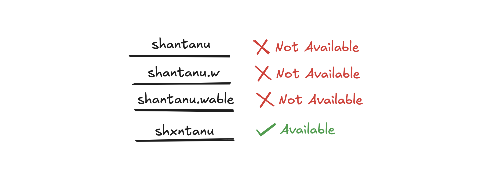

# hyperbloom

A collection of high performance bloom filter data structures for use in C. All filters use the 64-bit version of [Cyan4973](https://github.com/Cyan4973)'s [xxhash](https://github.com/Cyan4973/xxhash) algorithm


## What is a Bloom Filter?

<div align="center">



</div>

> This is a gist of the Bloom Filter. For an in-depth explanation and a much more visual understanding, checkout [this amazing article](https://systemdesign.one/bloom-filters-explained/) systemdesign.one.

While creating an account, you want to enter a cool username, you entered it and got a message, **“Username is already taken”**. You then tried a bunch of variations, and all kept saying that the username was taken until you found one that was still available. In this process, ever wondered how the website manages to search through millions of usernames to determine if it is taken?

Here is where a Bloom filter is used.

A Bloom filter is a space-efficient _probabilistic_ data structure that is used to check whether an item is a member of a set.
The bloom filter will always say **"yes"** if an item is a member of a particular set. However, it might still say "yes" although
an item is not a part of that set (false positives).

## Working of a Bloom Filter


The bloom filter data structure is a bit array of length n as shown above.
The position of the buckets is indicated by the index (0–n) for a bit array of length n.
All the bits in the bloom filter are set to zero when the bloom filter is initialized (an empty bloom filter).
The bloom filter discards the value of the items but stores only a set of bits identified by the execution of hash functions on the item.

### Adding an item to the set

The following operations are executed to add an item to the bloom filter:

-   the item is hashed through _k_ hash functions
-   the modulo _n_ (length of bit array) operation is executed on the output of the hash functions to identify the _k_ array positions (buckets)
-   the bits at all identified buckets are set to one

There is a probability that some bits on the array are set to one multiple times due to hash collisions.

### Checking the membership of an item in the set

The following operations are executed to check if an item is a member of the bloom filter:

-   the item is hashed through the same k-hash functions
-   the modulo n (length of bit array) operation is executed on the output of the hash functions to identify the k array positions (buckets)
-   verify if all the bits at identified buckets are set to one

If any of the identified bits are set to zero, the item is not a member of the bloom filter. If all the bits are set to one, the item might be a member of the bloom filter. The uncertainty about the membership of an item is due to the possibility of some bits being set to one by different items or due to hash function collisions.

## Building and Executing

Make sure you have CMake installed. Clone the repository and then download `vcpkg` to install required libraries.

```bash
git clone https://github.com/Microsoft/vcpkg.git
cd vcpkg
./bootstrap-vcpkg.sh
./vcpkg integrate install
```

Install the dependencies

```bash
./vcpkg install
```

Run CMake

```bash
cmake ..
```

Build and run the bloom test.

```bash
make
./bloom
```
